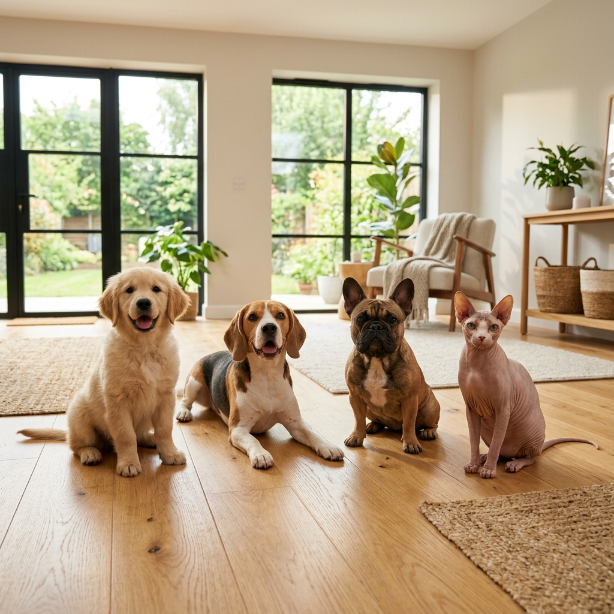

# LINEOS — Precision Animal Husbandry Platform



LINEOS is a full-spectrum digital platform designed for high-performance dog and cat breeders. It integrates advanced genetics, financial management, and health tracking into a seamless, premium experience.

## 🚀 Features

### 🧬 Genetic Intelligence
- **Inbreeding Simulator**: Calculate COI (Coefficient of Inbreeding) and projected ROI based on genetic depression costs.
- **Pedigree Management**: Track maternal and paternal lineages with automated kinship analysis.
- **Genetic Potential**: Evaluate EBV (Estimated Breeding Values) for selection.

### 💰 Financial Ecosystem
- **Litter Profitability**: Real-time ROI analysis for each breeding project.
- **DRE (Profit & Loss)**: Specialized accounting for kennel/cattery operations.
- **Cost Analysis**: Granular tracking of maintenance, health, and exhibition costs.

### 🏥 Health & Welfare
- **Precision Nutrition**: Automated dietary calculations based on FEDIAF 2025 guidelines.
- **Clinical History**: Comprehensive records of vaccinations, exams, and treatments.
- **Manejo Mobile**: Optimized interface for daily field operations.

### 🎨 Premium Branding
- **Custom UI**: Glassmorphism design and high-end aesthetics.
- **Secure Auth**: Integrated with Supabase (Email & Google Auth).

## 🛠️ Tech Stack

- **Frontend**: React 18, TypeScript, Vite.
- **Styling**: Tailwind CSS, Radix UI (Shadcn), Lucide icons.
- **State Management**: Zustand (Global Store), React Query (Async Logic).
- **Backend**: Supabase (PostgreSQL, Auth, RLS).
- **Animations**: Framer Motion, Sonner (Toasts).

## 📦 Getting Started

1. **Clone the repository**
   ```bash
   git clone https://github.com/Pmurata/lineos-breed-bloom-boost.git
   ```

2. **Install dependencies**
   ```bash
   npm install
   ```

3. **Configure Environment Variables**
   Create a `.env` file in the root:
   ```env
   VITE_SUPABASE_URL=your_project_url
   VITE_SUPABASE_ANON_KEY=your_anon_key
   ```

4. **Run the development server**
   ```bash
   npm run dev
   ```

## 🔐 Security

This project follows **Row-Level Security (RLS)** best practices. All breeder data is isolated by user ID, ensuring confidentiality and integrity across the ecosystem.

---
*Developed by LINEOS Team.*
